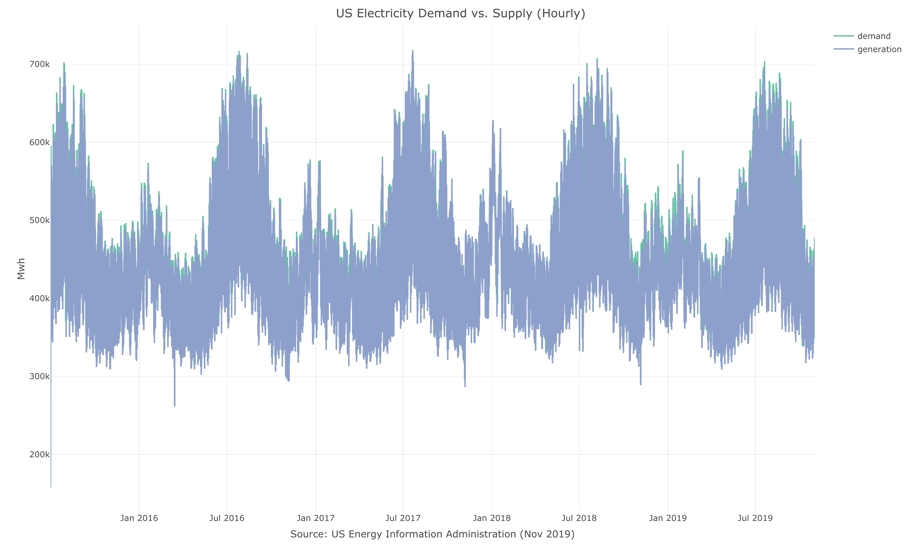

# USgrid

<!-- badges: start -->
[](https://www.tidyverse.org/lifecycle/#experimental)
<!-- badges: end -->

The USgrid R package provides a set of high frequency (hourly) time-series datasets, describing the demand and generation of electricity in the US. That includes the following series:

* `US_elec`  - the total hourly demand and supply (generation) for electricity in the US since July 2015

* `US_source` - the hourly demand for electricity in the US by energy source (natural gas, coal, solar, etc.) since July 2018

**Source:** [US Energy Information Administration](https://www.eia.gov/), Nov 2019

## Installation

Currently, the package available only on Github version:

``` r
remotes::install_github("RamiKrispin/USgrid")
```

## Example

The hourly demand and generation (supply) of electricty in the US:

``` r
library(USgrid)
library(plotly)

data(US_elec)

plot_ly(data = US_elec,
        x = ~ date_time,
        y = ~ series,
        color = ~ type,
        colors = c("#66C2A5","#8DA0CB"),
        type = "scatter",
        mode = "lines") %>%
        layout(title = "US Electricity Demand vs. Supply (Hourly)",
               yaxis = list(title = "Mwh"),
               xaxis = list(title = "Source: US Energy Information Administration (Nov 2019)"))
```



``` r
plot_ly(data = US_source,
        x = ~ date_time,
        y = ~ series,
        color = ~ source,
        type = "scatter",
        mode = "lines") %>%
  layout(title = "US Electricity Generation by Source",
         yaxis = list(title = "Mwh"),
         xaxis = list(title = "Source: US Energy Information Administration (Nov 2019)"))
```


