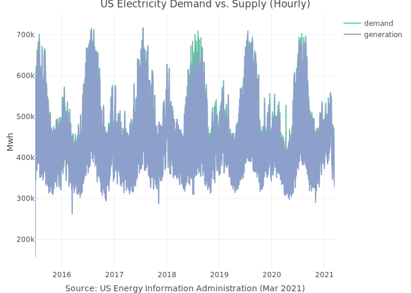
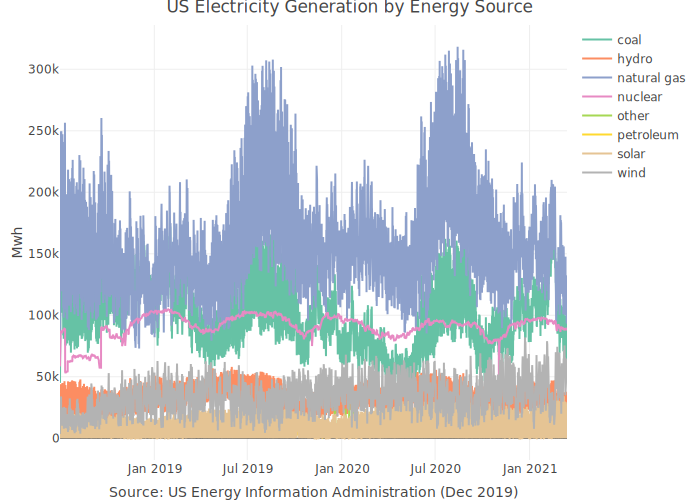
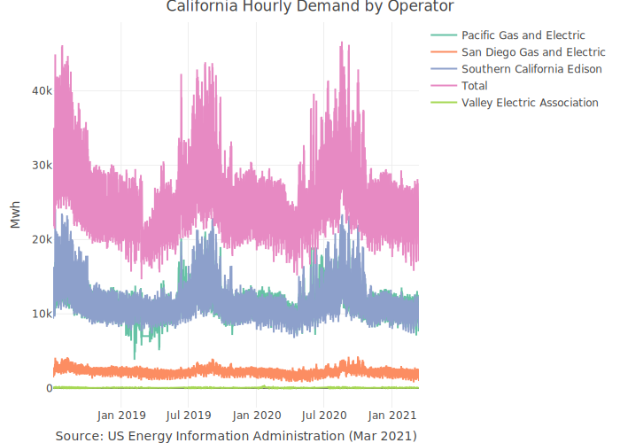

<!-- README.md is generated from README.Rmd. Please edit that file -->

# USgrid <a href='https://ramikrispin.github.io/USgrid/'></a>

<!-- badges: start -->

[](https://lifecycle.r-lib.org/articles/stages.html)
[](https://cran.r-project.org/package=USgrid)
[](https://opensource.org/licenses/MIT)
<!-- badges: end -->

The USgrid R package provides a set of high frequency (hourly)
time-series datasets, describing the demand and generation of
electricity in the US (lower-48 states, excluding Alaska and Hawaii).
That includes the following series:

-   `US_elec` - the total hourly demand and supply (generation) for
    electricity in the US since July 2015

-   `US_source` - the US net generation of electricity by energy source
    (natural gas, coal, solar, etc.) since July 2018

-   `Cal_elec` - The California subregion hourly demand by operator
    since July 2018

All datasets are in [tsibble](https://tsibble.tidyverts.org/index.html)
format

**Source:** [US Energy Information
Administration](https://www.eia.gov/),Mar 2021

## Installation

Install the stable version from
[CRAN](https://CRAN.R-project.org/package=USgrid):

``` r
install.packages("USgrid")
```

or install the development version from
[Github](https://github.com/RamiKrispin/USgrid):

``` r
# install.packages("remotes")
remotes::install_github("RamiKrispin/USgrid")
```

## Examples

The hourly demand and generation (supply) of electricty in the US:

``` r
library(USgrid)
library(plotly)

data(US_elec)

plot_ly(data = US_elec,
        x = ~ date_time,
        y = ~ series,
        color = ~ type,
        colors = c("#66C2A5","#8DA0CB"),
        type = "scatter",
        mode = "lines") %>%
        layout(title = "US Electricity Demand vs. Supply (Hourly)",
               yaxis = list(title = "Mwh"),
               xaxis = list(title = "Source: US Energy Information Administration (Mar 2021)"))
```



The hourly generation (supply) of electricty in the US by source:

``` r
data("US_source")

plot_ly(data = US_source,
        x = ~ date_time,
        y = ~ series,
        color = ~ source,
        type = "scatter",
        mode = "lines") %>%
  layout(title = "US Electricity Generation by Energy Source",
         yaxis = list(title = "Mwh"),
         xaxis = list(title = "Source: US Energy Information Administration (Mar 2021)"))
```



The California subregion hourly demand by operator

``` r
data("Cal_elec")

plot_ly(data = Cal_elec,
        x = ~ date_time,
        y = ~ series,
        color = ~ operator,
        type = "scatter",
        mode = "lines") %>%
  layout(title = "California Hourly Demand by Operator",
         yaxis = list(title = "Mwh"),
         xaxis = list(title = "Source: US Energy Information Administration (Mar 2021)"))
```


